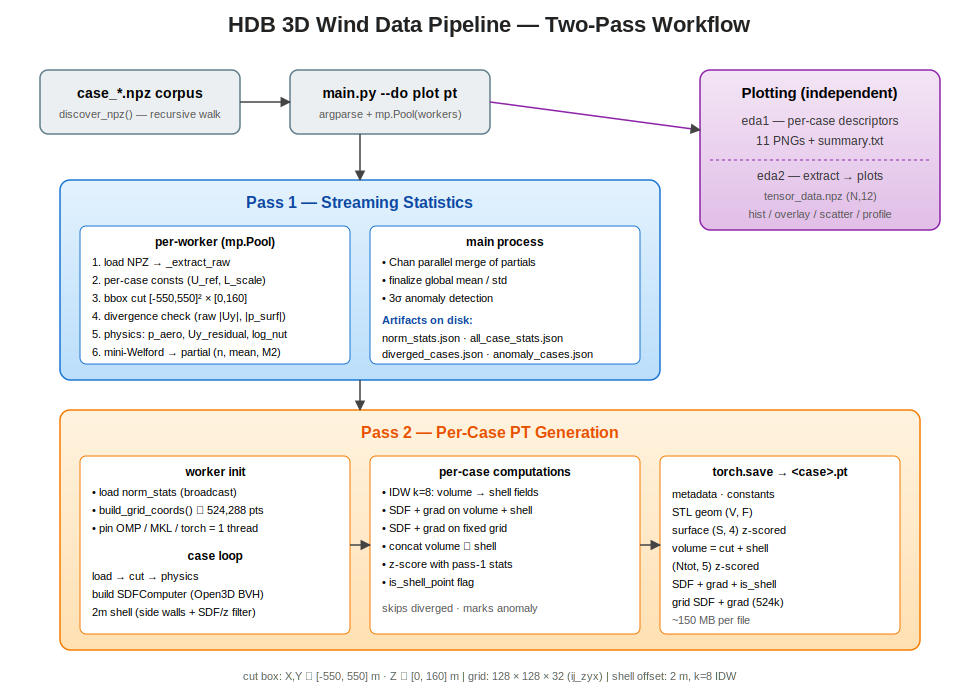
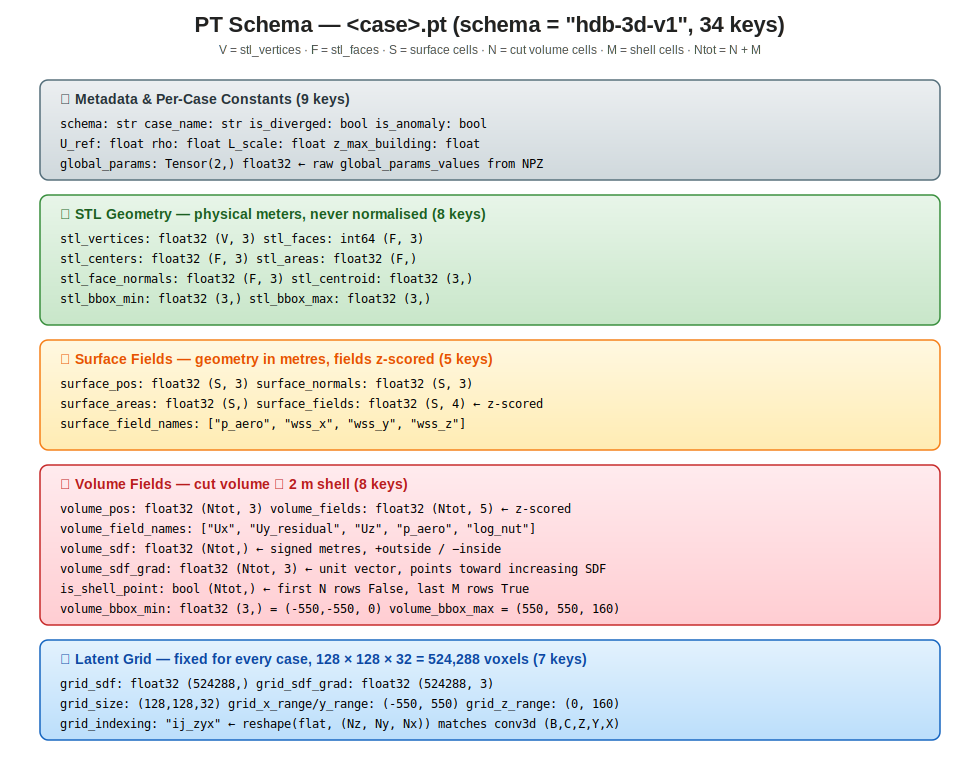

# HDB 3D Wind Data Pipeline

Turn OpenFOAM CFD outputs of high-density-building wind fields (NPZ) into
training-ready `.pt` files for 3D neural surrogates — plus a full EDA plot
suite for sanity-checking the corpus.

```
case_*.npz  ──►  Pass 1 (global stats)  ──►  Pass 2 (per-case PT)  ──►  <case>.pt
                          │
                          └────────►  EDA phase-1 / phase-2 plots
```

---

## 1. At a Glance

| | |
|---|---|
| **Input**  | one NPZ per CFD case (STL geometry + surface fields + volume fields) |
| **Output** | one `.pt` per case (z-scored fields, SDF + gradient, fixed-grid SDF), plus PNG plots and stats JSON |
| **Parallelism** | `multiprocessing.Pool`, one case per worker |
| **Stats** | streaming Welford with Chan parallel merge — works on corpora larger than RAM |
| **Geometry** | Open3D `RaycastingScene` SDF (BVH-accurate) + 2 m shell augmentation on side walls |

---

## 2. Pipeline Overview



Two passes over the corpus:

- **Pass 1 — streaming statistics.** Walk every NPZ in parallel, apply the
  physics transforms in memory, accumulate a Welford state per field, and
  flag diverged / anomalous cases. Emits `norm_stats.json`,
  `all_case_stats.json`, `diverged_cases.json`, `anomaly_cases.json`.
- **Pass 2 — per-case PT generation.** Walk every NPZ again, redo the
  physics, apply z-score using Pass-1 stats, build the Open3D SDF, add a
  2 m shell augmentation (IDW k=8), sample SDF + gradient on a fixed
  128 × 128 × 32 latent grid, and `torch.save` one record per case.

The plotting branch (`plot = eda1 + eda2`) runs independently of PT generation.

---

## 3. PT Schema

Every `<case>.pt` is a single Python `dict` with **34 keys** grouped into five
blocks:



Key conventions:

- **Geometry is always in physical metres** — STL, surface, volume, shell.
- **Fields are z-scored** with global Pass-1 stats — both surface and
  volume (volume includes IDW-interpolated shell rows, scored with the
  same stats).
- **SDF convention**: positive outside the building, negative inside;
  gradient is a unit vector pointing toward increasing SDF (i.e. outward
  from the surface everywhere).
- **Grid indexing** `"ij_zyx"`: flat index = `k·Nx·Ny + j·Nx + i`, which
  recovers `(Nz, Ny, Nx)` under `reshape` — matches `(B, C, Z, Y, X)` for
  3D convs.

A single PT for a typical case (~2.9 M volume cells) is **~150 MB** on
disk.

---

## 4. Quick Start

### Install

```bash
pip install -r requirements.txt
```

`requirements.txt` pulls in `numpy`, `scipy`, `torch`, `open3d`, `tqdm`,
`matplotlib`, `scikit-learn`.

### Run everything

```bash
python main.py --data_dir /path/to/hdb_npz \
               --out_dir  /scratch/out \
               --workers 32
```

This generates plots **first**, then the PT files.

### Run subsets

```bash
# PT generation only
python main.py --data_dir … --out_dir … --do pt

# EDA only (phase 1 only / phase 2 only / both)
python main.py --data_dir … --out_dir … --do eda1
python main.py --data_dir … --out_dir … --do eda2
python main.py --data_dir … --out_dir … --do plot

# Resume PT generation, skip cases already on disk
python main.py … --do pt --skip_existing
```

### Smoke test

```bash
python tests/smoke_test.py
```

Builds three synthetic box-shaped cases, runs Pass 1 + Pass 2, and
asserts every key / shape / dtype in the PT schema (also checks SDF
gradients are unit length and shell points obey the validity filters).

---

## 5. Output Layout

```
out_dir/
├── pt/                     ← one .pt per case (only non-diverged)
│   └── case_HDB_0001.pt
├── norm_stats.json         ← global mean/std for z-score
├── all_case_stats.json     ← per-case raw + post-transform stats
├── diverged_cases.json     ← skipped in Pass 2
├── anomaly_cases.json      ← 3-σ outliers (flagged, not skipped)
├── pt_failures.json        ← per-case Pass-2 errors (if any)
└── plots/
    ├── eda1/               ← 11 PNGs + summary.txt
    └── eda2/
        ├── tensor_data.npz ← (N_rows, 12) cached intermediate
        ├── hist_by_height/, hist_by_thickness/
        ├── overlay/, scatter/
        └── profile_by_z/,  profile_by_thick/
```

---

## 6. Physics Conventions

All transforms live in `pipeline/physics.py`. Briefly:

- **Free stream blows along −Y** with speed `U_ref`, so
  `Uy_residual = Uy + U_ref` ≈ 0 in the far field.
- **Pressure** in NPZ is OpenFOAM **kinematic** pressure (units m²/s²,
  i.e. p_static / ρ). The non-dimensional, hydrostatically detrended
  pressure is `p_aero = (p_kin + g·z) / U_ref²` — Cp-like, O(1).
- **Wall shear stress** (kinematic) is non-dimensionalised by `U_ref²`.
- **Turbulent viscosity** is log-compressed with the per-case building
  height: `log_nut = log(max(nut · L_scale, 1e-12))`, with
  `L_scale = max(z_max_building, 1.0)`.

Divergence thresholds (`|Uy| > 5·U_ref`, `|p_surf_kin| > 10 000`) are
applied to **raw** fields in `pipeline/stats.py`.

---

## 7. Module Map

```
main.py                       CLI / orchestration
pipeline/
  discover.py                 NPZ file discovery
  grid.py                     fixed 128×128×32 latent grid
  physics.py                  p_aero, Uy_residual, log_nut, field name constants
  sdf3d.py                    Open3D-backed signed distance + unit gradient
  shell.py                    2 m side-wall shell point generation with SDF/z filters
  idw.py                      k-NN inverse-distance interpolation (cKDTree)
  stats.py                    Welford accum (per-worker + Chan merge), divergence, 3-σ anomaly
  transform.py                two-pass NPZ → PT (run_pass1, run_pass2, run_pt_pipeline)
plotting/
  eda1.py                     per-case descriptors → 11 PNGs + summary
  eda2_extract.py             per-floor windward/leeward shell-vs-surface table
  eda2_plots.py               histograms, overlays, scatters, profiles
tests/
  smoke_test.py               synthetic end-to-end PT check
docs/
  pipeline_flow.svg, pt_schema.svg
```

---

## 8. Configuration Knobs (in code)

| Knob | Where | Default |
|---|---|---|
| Cut box | `pipeline/transform.py` `CUT_X/Y/Z` | `[-550,550]² × [0,160] m` |
| Shell offset | `pipeline/transform.py` `SHELL_OFFSET_M` | `2.0 m` |
| Shell IDW neighbours | `SHELL_IDW_K` | `8` |
| Side-wall normal threshold | `pipeline/shell.py` `SIDE_WALL_NORMAL_Z_MAX` | `0.5` |
| Shell validity SDF / z floors | `DEFAULT_MIN_SDF_M`, `DEFAULT_MIN_Z_M` | `1.0 m` each |
| Grid resolution | `pipeline/grid.py` | `128 × 128 × 32` |
| Divergence thresholds | `pipeline/stats.py` | `|Uy|>5·U_ref`, `|p_surf|>10 000` |
| Anomaly σ | `pipeline/stats.py` `ANOMALY_SIGMA` | `3.0` |

---

## 9. NPZ Input Schema (expected keys)

| key | shape | notes |
|---|---|---|
| `stl_coordinates` | `(V, 3)` float32 | mesh vertices |
| `stl_faces` | `(F·3,)` or `(F, 3)` | indices; float-encoded ints are accepted (cast to int64) |
| `stl_centers` | `(F, 3)` float32 | per-face centroids |
| `stl_areas` | `(F,)` float32 | |
| `surface_mesh_centers` | `(S, 3)` float32 | CFD surface samples |
| `surface_normals` | `(S, 3)` float32 | |
| `surface_areas` | `(S,)` float32 | |
| `surface_fields` | `(S, 4)` float32 | `[p_kin, wss_x, wss_y, wss_z]` |
| `volume_mesh_centers` | `(N, 3)` float32 | CFD volume samples |
| `volume_fields` | `(N, 5)` float32 | `[Ux, Uy, Uz, p_kin, nut]` |
| `global_params_values` | `(2,)` float32 | `[U_ref, rho]` (≤0 ⇒ fallback 2.0 / 1.225) |

`filename` and `global_params_reference` are ignored if present.

---

## 10. Performance Notes

- One PT file ≈ **150 MB** at the production case size (~2.9 M volume cells).
- Pass-2 wall time per case is dominated by Open3D SDF queries
  (volume + shell + 524 k grid points) and the cKDTree build for IDW.
- `_pass2_init` pins `torch / OMP / MKL` to 1 thread per worker; scipy's
  `cKDTree.query(workers=-1)` still uses all cores — keep `--workers`
  below `cpu_count` if you see oversubscription.

---

## 11. Caveats

- **STL must be watertight with consistent winding** for the SDF *sign* to
  be meaningful and for the on-surface gradient fallback (face normal)
  to point outward. The pipeline does not currently validate this.
- **Anomaly cases are flagged but not dropped** in Pass 2 — downstream
  consumers decide whether to filter `is_anomaly == True`.
- **Bbox cut happens before divergence check** — divergence outside the
  cut box is invisible to Pass 1.
